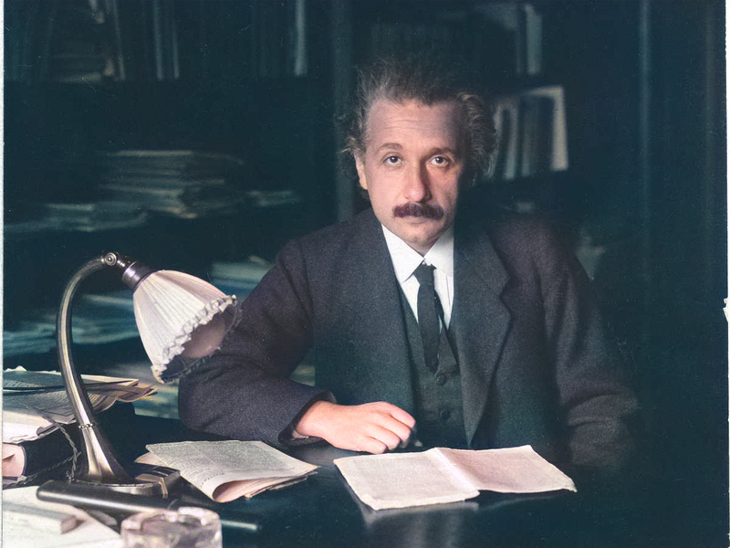

# Grey2RGB (Image Colorization using Deep Learning)

This project implements an image colorization algorithm using deep learning and OpenCV. The algorithm takes a black and white image as input and produces a colorized version of the image.

## Table of Contents
- [Introduction](#introduction)
- [Setup](#setup)
- [Usage](#usage)
- [Results](#results)
- [License](#license)

## Introduction

Image colorization is the process of adding color information to black and white images. This project utilizes a pre-trained deep learning model to automatically colorize black and white images. The model is trained on a large dataset of colored images and can generate plausible colorizations for grayscale input images.

## Setup

To use this project, you need to set up the following:

1. Python environment: Make sure you have Python installed on your system.
2. Required libraries: Install the necessary libraries by running the following command:
```bash
pip install numpy opencv-python
```
3. Pre-trained model and configuration files: Download the pre-trained model and its configuration files from the following link and place them in the `model` directory of this project:
 - 1. colorization_deploy_v2.prototxt: https://github.com/richzhang/colorization/tree/caffe/colorization/models
 - 2. pts_in_hull.npy: https://github.com/richzhang/colorization/blob/caffe/colorization/resources/pts_in_hull.npy
 - 3. colorization_release_v2.caffemodel: https://www.dropbox.com/s/dx0qvhhp5hbcx7z/colorization_release_v2.caffemodel?dl=1

## Usage

To colorize a black and white image, follow these steps:

1. Open a terminal or command prompt.
2. Navigate to the project directory.
3. Run the following command:
```bash
python colorize_image.py -i <path_to_input_image>
```
Replace `<path_to_input_image>` with the path to your black and white image.
4. The colorized image will be displayed in a new window.

## Results

Here are some examples of colorized images produced by this algorithm:

 

> The project is inspired from http://richzhang.github.io/colorization/
